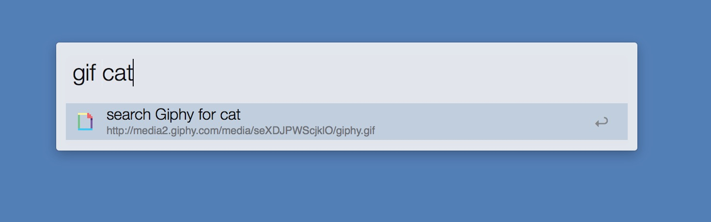

# Giphy4alfred
Alfred workflow to fetch some gif animation file from Giphy.

## This version has some problems
- when you retype "gif", maybe the thumbnail is wrong.  
- if you type some keywords for search gif in Giphy , for example "gif cat", it take long time to get accurate results.  

# how to use 
[Download](./gif.alfredworkflow?raw=ture)

##### If you'd like to random gif image,  
1. type "gif"  
2. wait a few minutes    

##### If you'd like to some gif image to search,  
1. type "gif {query}"  
2. wait a minutes  

Enter : Copy URL to clipboard and Paste automatically  
Shift + Enter : Copy URL in Markdown to clipboard and Paste automatically  
Control + Enter : Open URL in your browser
